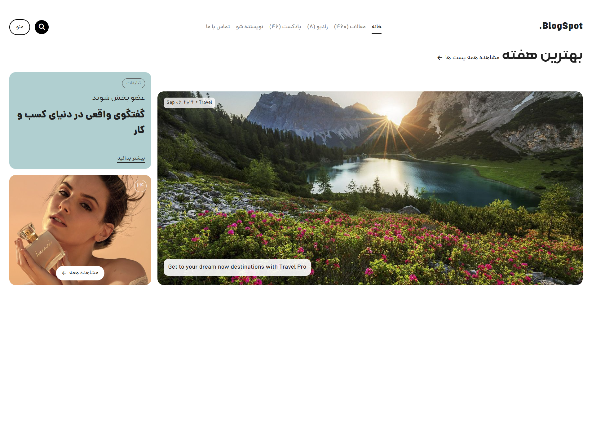

# BlogSpot - قالب وردپرس

> یک قالب وردپرس مدرن و چند منظوره برای وبلاگ‌ها و سایت‌های محتوایی با تمرکز بر مقالات و پادکست‌ها، همراه با امکانات پیشرفته شخصی‌سازی و بهینه‌سازی شده برای SEO



<div dir="rtl" style="text-align: right;">

## معرفی
BlogSpot یک قالب وردپرس مدرن و زیبا است که برای وبلاگ‌ها و سایت‌های محتوایی طراحی شده است. این قالب با تمرکز بر تجربه کاربری و طراحی زیبا، امکانات متنوعی را برای مدیریت محتوا ارائه می‌دهد.

## زبان‌ها و تکنولوژی‌ها
### زبان‌های برنامه‌نویسی
- PHP (نسخه 7.4 یا بالاتر)
- JavaScript (ES6+)
- HTML5
- CSS3 (با پشتیبانی از Flexbox و Grid)
- SCSS 

### فریم‌ورک‌ها و کتابخانه‌ها
- WordPress Theme Development
- jQuery (برای سازگاری با افزونه‌های وردپرس)
- Bootstrap 5 (برای طراحی واکنش‌گرا)
- Font Awesome (برای آیکون‌ها)

### ویژگی‌های فنی
- پشتیبانی از RTL
- بهینه‌سازی برای موتورهای جستجو (SEO)
- سازگار با آخرین نسخه وردپرس
- پشتیبانی از Gutenberg
- بهینه‌سازی سرعت بارگذاری
- پشتیبانی از WebP تصاویر
- سیستم کش داخلی
- امنیت پیشرفته

## امکانات قالب
### ویژگی‌های عمومی
- طراحی واکنش‌گرا و مدرن
- پشتیبانی از مقالات و پادکست‌ها
- سیستم مدیریت تبلیغات
- فرم تماس با ما
- جستجوی پیشرفته
- قابلیت شخصی‌سازی بخش‌های مختلف

### سیستم اشتراک پادکست
- **فرم اشتراک ساده**: فرم آسان برای عضویت کاربران در به‌روزرسانی‌های پادکست
- **پایگاه داده اشتراک‌ها**: ذخیره‌سازی امن اطلاعات اشتراک‌ها
- **داشبورد مدیریت**: رابط کاربری کامل مدیریت اشتراک‌ها
- **عملیات گروهی**: فعال‌سازی، غیرفعال‌سازی یا حذف چندین اشتراک
- **پیگیری وضعیت**: نظارت بر کاربران فعال، غیرفعال و لغو اشتراک شده
- **خروجی**: خروجی گرفتن لیست اشتراک‌ها به فرمت CSV

### اطلاع‌رسانی ایمیلی
- **اطلاع‌رسانی خودکار**: ارسال ایمیل هنگام انتشار قسمت‌های جدید پادکست
- **ایمیل دستی**: ارسال ایمیل‌های سفارشی به همه اشتراک‌ها
- **قالب‌های زیبا**: قالب‌های ایمیل حرفه‌ای و واکنش‌گرا
- **پشتیبانی از RTL**: پشتیبانی کامل از متن فارسی/عربی
- **محتوای قابل تنظیم**: ویرایش موضوع، محتوا و دکمه‌های فراخوان به عمل
- **پیش‌نمایش زنده**: مشاهده نحوه نمایش ایمیل قبل از ارسال

### ویژگی‌های امنیتی
- **تایید توکن**: محافظت در برابر حملات CSRF
- **پاکسازی ورودی**: مدیریت امن ورودی کاربر
- **اعتبارسنجی ایمیل**: بررسی آدرس‌های ایمیل معتبر
- **تشخیص ایمیل‌های موقت**: جلوگیری از اشتراک‌های اسپم
- **لغو اشتراک امن**: لینک‌های لغو اشتراک مبتنی بر توکن

### قالب‌های ایمیل
- **طراحی واکنش‌گرا**: نمایش مناسب در تمام دستگاه‌ها
- **برندینگ سفارشی**: شامل نام و لوگوی سایت شما
- **لینک‌های شبکه‌های اجتماعی**: دسترسی آسان به شبکه‌های اجتماعی
- **گزینه لغو اشتراک**: لینک واضح لغو اشتراک در هر ایمیل
- **دکمه‌های قابل تنظیم**: اضافه کردن دکمه‌های فراخوان به عمل

## بخش‌های قابل شخصی‌سازی
### بخش پیکس
- تصویر پس زمینه
- نوع شمارنده (همه مطالب، مقالات، پادکست‌ها یا عدد دلخواه)
- لینک و متن دکمه

### صفحات تماس و پادکست
- تصویر پس زمینه
- ارتفاع کانتینر

## راهنمای نصب و استفاده

### نصب قالب
1. فایل قالب را در پوشه `wp-content/themes` آپلود کنید
2. از طریق پنل مدیریت وردپرس، به بخش "ظاهر" > "قالب‌ها" بروید
3. قالب BlogSpot را فعال کنید

### نصب سیستم اشتراک پادکست
1. فایل `podcast-subscription.php` را در قالب خود قرار دهید:
   ```php
   require get_template_directory() . '/inc/podcast-subscription.php';
   ```

2. فرم اشتراک را به قالب خود اضافه کنید:
   ```php
   <form id="podcast-subscription-form">
       <input type="text" name="name" required>
       <input type="email" name="email" required>
       <button type="submit">اشتراک</button>
   </form>
   ```

3. جاوااسکریپت مورد نیاز را اضافه کنید:
   ```javascript
   jQuery(document).ready(function($) {
       $('#podcast-subscription-form').on('submit', function(e) {
           e.preventDefault();
           // مدیریت ارسال فرم
       });
   });
   ```

### تنظیمات قالب
پس از نصب قالب، می‌توانید از طریق بخش "شخصی‌سازی" در پنل مدیریت وردپرس، تنظیمات زیر را انجام دهید:

#### تنظیمات بخش پیکس
- آپلود تصویر پس زمینه
- انتخاب نوع شمارنده
- تنظیم عدد دلخواه (در صورت انتخاب)
- تغییر لینک و متن دکمه

#### تنظیمات صفحات
- تنظیم تصویر پس زمینه صفحات تماس و پادکست
- تنظیم ارتفاع کانتینر‌ها

### مدیریت اشتراک‌های پادکست

#### دسترسی به مدیریت اشتراک‌ها
- به بخش "اشتراک‌های پادکست" در مدیریت وردپرس بروید
- مشاهده تمام اشتراک‌ها و وضعیت آن‌ها
- انجام عملیات گروهی روی اشتراک‌ها
- خروجی گرفتن لیست اشتراک‌ها

#### ارسال ایمیل دستی
- از فرم ایمیل در صفحه مدیریت اشتراک‌ها استفاده کنید
- موضوع و محتوا را سفارشی کنید
- دکمه فراخوان به عمل اختیاری اضافه کنید
- قبل از ارسال، ایمیل را پیش‌نمایش کنید
- پیگیری ایمیل‌های ارسال شده و ناموفق

#### تست تنظیمات ایمیل
- از دکمه "تست تنظیمات ایمیل" استفاده کنید
- صحت پیکربندی ایمیل خود را بررسی کنید
- در صورت بروز مشکل، پیام‌های خطای دقیق دریافت کنید

## راهنمای توسعه‌دهندگان

### ساختار پایگاه داده
```sql
wp_podcast_subscribers
- id (mediumint)
- name (varchar)
- email (varchar)
- status (varchar)
- date_subscribed (datetime)
```

### توابع موجود
```php
// ایجاد جدول اشتراک‌ها
blogspot_create_subscribers_table();

// مدیریت اشتراک
blogspot_handle_podcast_subscription();

// ارسال ایمیل‌های به‌روزرسانی پادکست
blogspot_send_podcast_update_emails($post_id);

// دریافت قالب ایمیل
blogspot_get_email_template($title, $content, $button_text, $button_url, $unsubscribe_url);
```

### هوک‌ها و فیلترها
```php
// پس از فعال‌سازی قالب
add_action('after_switch_theme', 'blogspot_create_subscribers_table');

// هنگام انتشار پادکست
add_action('publish_podcast', 'blogspot_send_podcast_update_emails');
```

## نیازمندی‌ها
- وردپرس ۵.۰ یا بالاتر
- PHP ۷.۲ یا بالاتر
- MySQL ۵.۶ یا بالاتر
- jQuery (در وردپرس موجود است)

## پشتیبانی
برای پشتیبانی و گزارش مشکلات، لطفاً از طریق بخش Issues در مخزن گیت‌هاب اقدام کنید.

## مجوز
این قالب تحت مجوز GPL v2 یا بالاتر منتشر شده است.

## تغییرات
### نسخه 1.0.0
- انتشار اولیه قالب
- اضافه کردن سیستم مدیریت مقالات و پادکست‌ها
- اضافه کردن فرم تماس با ما
- اضافه کردن سیستم عضویت در پادکست
- اضافه کردن قابلیت شخصی‌سازی بخش‌های مختلف

</div> 